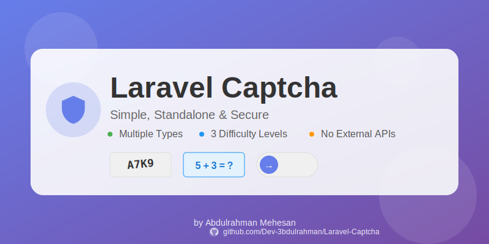

# Laravel Captcha

<p align="center">
    
</p>

<p align="center">
    <a href="https://packagist.org/packages/dev-3bdulrahman/laravel-captcha"></a>
    <a href="https://packagist.org/packages/dev-3bdulrahman/laravel-captcha"></a>
    <a href="https://packagist.org/packages/dev-3bdulrahman/laravel-captcha"></a>
</p>

باكج Laravel بسيطة ومستقلة للتحقق من الكابتشا مع أنماط ومستويات صعوبة متعددة. لا تحتاج إلى خدمات خارجية!

[English](README.md) | **العربية**

## ✨ المميزات

- 🎨 **أنواع متعددة من الكابتشا**: صورة، رياضيات، نص، وسلايدر
- 🎯 **ثلاثة مستويات صعوبة**: سهل، متوسط، وصعب
- 🎭 **أنماط بصرية متعددة**: افتراضي، حديث، بسيط، وملون
- 🔒 **مستقلة تماماً**: لا تحتاج Google reCAPTCHA أو خدمات خارجية
- 🚀 **سهلة التكامل**: مكونات Blade بسيطة وقواعد التحقق
- 📱 **تصميم متجاوب**: تعمل بشكل مثالي على جميع الأجهزة
- ⚡ **خفيفة الوزن**: الحد الأدنى من التبعيات، أقصى أداء
- 🎨 **قابلة للتخصيص**: خيارات تكوين واسعة

## 📋 المتطلبات

- PHP 8.0 أو أحدث
- Laravel 9.x، 10.x، أو 11.x
- مكتبة GD (للكابتشا الصورية)

## 📦 التثبيت

قم بتثبيت الباكج عبر Composer:

```bash
composer require dev-3bdulrahman/laravel-captcha
```

نشر ملف الإعدادات:

```bash
php artisan vendor:publish --tag=captcha-config
```

نشر الملفات (CSS، JS):

```bash
php artisan vendor:publish --tag=captcha-assets
```

اختيارياً، نشر الـ Views للتخصيص:

```bash
php artisan vendor:publish --tag=captcha-views
```

## 🚀 البدء السريع

### 1. إضافة الكابتشا إلى النموذج

```blade
<form method="POST" action="/submit">
    @csrf
    
    <!-- حقول النموذج الخاصة بك -->
    
    @include('captcha::captcha', ['type' => 'image', 'difficulty' => 'medium'])
    
    <button type="submit">إرسال</button>
</form>
```

### 2. التحقق من الكابتشا

```php
use Illuminate\Http\Request;

public function submit(Request $request)
{
    $request->validate([
        'captcha' => 'required|captcha',
        // قواعد أخرى...
    ]);
    
    // معالجة النموذج
}
```

هذا كل شيء! 🎉

## 📚 الاستخدام

### أنواع الكابتشا

#### كابتشا الصورة (الافتراضي)

```blade
@include('captcha::captcha', [
    'type' => 'image',
    'difficulty' => 'medium',
    'style' => 'modern'
])
```

#### كابتشا الرياضيات

```blade
@include('captcha::captcha', [
    'type' => 'math',
    'difficulty' => 'easy'
])
```

#### كابتشا النص

```blade
@include('captcha::captcha', [
    'type' => 'text',
    'difficulty' => 'hard'
])
```

#### كابتشا السلايدر

```blade
@include('captcha::captcha', [
    'type' => 'slider',
    'difficulty' => 'medium'
])
```

### مستويات الصعوبة

- **سهل**: تحديات بسيطة، أحرف/عمليات أقل
- **متوسط**: تعقيد معتدل (افتراضي)
- **صعب**: تحديات معقدة مع المزيد من التشويش والصعوبة

### الأنماط البصرية

- **default**: المظهر الكلاسيكي للكابتشا
- **modern**: تصميم أنيق ومعاصر
- **minimal**: نظيف وبسيط
- **colorful**: نابض بالحياة وملفت للنظر

### استخدام الـ Facade

```php
use Dev3bdulrahman\LaravelCaptcha\Facades\Captcha;

// توليد كابتشا
$data = Captcha::generate('image', 'medium');

// التحقق من الكابتشا
$isValid = Captcha::verify($input, 'image');

// تحديث الكابتشا
Captcha::refresh('image');

// الحصول على بيانات الكابتشا
$data = Captcha::getData('image');
```

### استخدام الدوال المساعدة

```php
// توليد كابتشا
$data = captcha('image', 'medium');

// التحقق من الكابتشا
if (captcha_verify($input, 'image')) {
    // صحيح
}

// الحصول على رابط الصورة
$url = captcha_img('image', 'medium');
```

## ⚙️ الإعدادات

ملف الإعدادات `config/captcha.php` يسمح لك بتخصيص:

```php
return [
    // نوع الكابتشا الافتراضي
    'default' => 'image',
    
    // مستوى الصعوبة الافتراضي
    'difficulty' => 'medium',
    
    // مفتاح الجلسة لتخزين الكابتشا
    'session_key' => 'laravel_captcha',
    
    // وقت انتهاء الصلاحية بالدقائق
    'expire' => 5,
    
    // إعدادات كابتشا الصورة
    'image' => [
        'width' => 200,
        'height' => 60,
        'length' => [
            'easy' => 4,
            'medium' => 5,
            'hard' => 6,
        ],
        // ... المزيد من الإعدادات
    ],
    
    // ... إعدادات أخرى
];
```

## 🎨 التخصيص

### أسئلة مخصصة لكابتشا النص

عدّل `config/captcha.php`:

```php
'text' => [
    'questions' => [
        'easy' => [
            'ما لون السماء؟' => 'ازرق',
            'كم عدد أيام الأسبوع؟' => '7',
            // أضف المزيد من الأسئلة
        ],
    ],
],
```

### تخصيص التصميم

انشر الـ Views وعدّل CSS:

```bash
php artisan vendor:publish --tag=captcha-views
```

ثم عدّل الملفات في `resources/views/vendor/captcha/`.

## 🧪 الاختبار

```bash
composer test
```

## 📖 أمثلة

### مثال 1: نموذج اتصال

```blade
<form method="POST" action="{{ route('contact.submit') }}">
    @csrf
    
    <input type="text" name="name" placeholder="اسمك" required>
    <input type="email" name="email" placeholder="بريدك الإلكتروني" required>
    <textarea name="message" placeholder="رسالتك" required></textarea>
    
    @include('captcha::captcha', ['type' => 'math', 'difficulty' => 'easy'])
    
    @error('captcha')
        <span class="error">{{ $message }}</span>
    @enderror
    
    <button type="submit">إرسال الرسالة</button>
</form>
```

### مثال 2: نموذج التسجيل

```blade
<form method="POST" action="{{ route('register') }}">
    @csrf
    
    <!-- حقول التسجيل -->
    
    @include('captcha::captcha', [
        'type' => 'image',
        'difficulty' => 'medium',
        'style' => 'modern'
    ])
    
    <button type="submit">تسجيل</button>
</form>
```

## 🤝 المساهمة

المساهمات مرحب بها! يرجى الاطلاع على [CONTRIBUTING.md](CONTRIBUTING.md) للتفاصيل.

## 📝 الترخيص

هذه الباكج مفتوحة المصدر ومرخصة بموجب [رخصة MIT](LICENSE).

## 👨‍💻 المطور

**عبدالرحمن محيسن**

- الموقع: [https://3bdulrahman.com/](https://3bdulrahman.com/)
- GitHub: [@Dev-3bdulrahman](https://github.com/Dev-3bdulrahman)

## 🙏 الدعم

إذا وجدت هذه الباكج مفيدة، يرجى النظر في إعطائها ⭐ على [GitHub](https://github.com/Dev-3bdulrahman/Laravel-Captcha)!

## 📸 لقطات الشاشة

### كابتشا الصورة


### كابتشا الرياضيات


### كابتشا النص


### كابتشا السلايدر


---

صُنع بـ ❤️ بواسطة [عبدالرحمن محيسن](https://3bdulrahman.com/)

