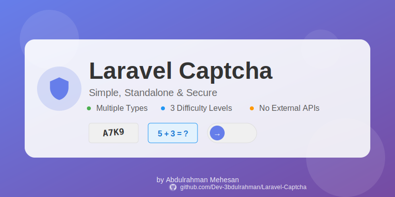

# Laravel Captcha

<p align="center">
    
</p>

<p align="center">
    <a href="https://packagist.org/packages/dev-3bdulrahman/laravel-captcha"></a>
    <a href="https://packagist.org/packages/dev-3bdulrahman/laravel-captcha"></a>
    <a href="https://packagist.org/packages/dev-3bdulrahman/laravel-captcha"></a>
</p>

A simple, standalone Laravel CAPTCHA package with multiple styles and difficulty levels. No external dependencies or third-party services required!

## ✨ Features

- 🎨 **Multiple Captcha Types**: Image, Math, Text, and Slider captchas
- 🎯 **Three Difficulty Levels**: Easy, Medium, and Hard
- 🎭 **Multiple Visual Styles**: Default, Modern, Minimal, and Colorful
- 🔒 **Fully Standalone**: No Google reCAPTCHA or external services
- 🚀 **Easy Integration**: Simple Blade components and validation rules
- 📱 **Responsive Design**: Works perfectly on all devices
- ⚡ **Lightweight**: Minimal dependencies, maximum performance
- 🎨 **Customizable**: Extensive configuration options

## 📋 Requirements

- PHP 8.0 or higher
- Laravel 9.x, 10.x, or 11.x
- GD Library (for image captcha)

## 📦 Installation

Install the package via Composer:

```bash
composer require dev-3bdulrahman/laravel-captcha
```

Publish the configuration file:

```bash
php artisan vendor:publish --tag=captcha-config
```

Publish the assets (CSS, JS):

```bash
php artisan vendor:publish --tag=captcha-assets
```

Optionally, publish the views for customization:

```bash
php artisan vendor:publish --tag=captcha-views
```

## 🚀 Quick Start

### 1. Add Captcha to Your Form

```blade
<form method="POST" action="/submit">
    @csrf
    
    <!-- Your form fields -->
    
    @include('captcha::captcha', ['type' => 'image', 'difficulty' => 'medium'])
    
    <button type="submit">Submit</button>
</form>
```

### 2. Validate the Captcha

```php
use Illuminate\Http\Request;

public function submit(Request $request)
{
    $request->validate([
        'captcha' => 'required|captcha',
        // other validation rules
    ]);
    
    // Process your form
}
```

That's it! 🎉

## 📚 Usage

### Captcha Types

#### Image Captcha (Default)

```blade
@include('captcha::captcha', [
    'type' => 'image',
    'difficulty' => 'medium',
    'style' => 'modern'
])
```

#### Math Captcha

```blade
@include('captcha::captcha', [
    'type' => 'math',
    'difficulty' => 'easy'
])
```

#### Text Captcha

```blade
@include('captcha::captcha', [
    'type' => 'text',
    'difficulty' => 'hard'
])
```

#### Slider Captcha

```blade
@include('captcha::captcha', [
    'type' => 'slider',
    'difficulty' => 'medium'
])
```

### Difficulty Levels

- **Easy**: Simple challenges, fewer characters/operations
- **Medium**: Moderate complexity (default)
- **Hard**: Complex challenges with more noise and difficulty

### Visual Styles

- **default**: Classic captcha appearance
- **modern**: Sleek, contemporary design
- **minimal**: Clean and simple
- **colorful**: Vibrant and eye-catching

### Using the Facade

```php
use Dev3bdulrahman\LaravelCaptcha\Facades\Captcha;

// Generate captcha
$data = Captcha::generate('image', 'medium');

// Verify captcha
$isValid = Captcha::verify($input, 'image');

// Refresh captcha
Captcha::refresh('image');

// Get captcha data
$data = Captcha::getData('image');
```

### Manual Validation

```php
use Dev3bdulrahman\LaravelCaptcha\Facades\Captcha;

if (Captcha::verify($request->input('captcha'), 'image')) {
    // Captcha is valid
} else {
    // Captcha is invalid
}
```

### API Routes

The package automatically registers these routes:

- `GET /captcha/generate/{type?}` - Generate captcha data
- `GET /captcha/image/{type?}` - Get captcha image
- `POST /captcha/verify` - Verify captcha
- `GET /captcha/refresh` - Refresh captcha

## ⚙️ Configuration

The configuration file `config/captcha.php` allows you to customize:

```php
return [
    // Default captcha type
    'default' => 'image',
    
    // Default difficulty level
    'difficulty' => 'medium',
    
    // Session key for storing captcha
    'session_key' => 'laravel_captcha',
    
    // Expiration time in minutes
    'expire' => 5,
    
    // Image captcha settings
    'image' => [
        'width' => 200,
        'height' => 60,
        'length' => [
            'easy' => 4,
            'medium' => 5,
            'hard' => 6,
        ],
        // ... more settings
    ],
    
    // Math captcha settings
    'math' => [
        'operators' => [
            'easy' => ['+', '-'],
            'medium' => ['+', '-', '*'],
            'hard' => ['+', '-', '*', '/'],
        ],
        // ... more settings
    ],
    
    // ... other settings
];
```

## 🎨 Customization

### Custom Questions for Text Captcha

Edit `config/captcha.php`:

```php
'text' => [
    'questions' => [
        'easy' => [
            'Your question?' => 'answer',
            // Add more questions
        ],
    ],
],
```

### Custom Styling

Publish the views and modify the CSS:

```bash
php artisan vendor:publish --tag=captcha-views
```

Then edit the files in `resources/views/vendor/captcha/`.

## 🧪 Testing

```bash
composer test
```

## 📖 Examples

### Example 1: Contact Form

```blade
<form method="POST" action="{{ route('contact.submit') }}">
    @csrf
    
    <input type="text" name="name" placeholder="Your Name" required>
    <input type="email" name="email" placeholder="Your Email" required>
    <textarea name="message" placeholder="Your Message" required></textarea>
    
    @include('captcha::captcha', ['type' => 'math', 'difficulty' => 'easy'])
    
    @error('captcha')
        <span class="error">{{ $message }}</span>
    @enderror
    
    <button type="submit">Send Message</button>
</form>
```

### Example 2: Registration Form

```blade
<form method="POST" action="{{ route('register') }}">
    @csrf
    
    <!-- Registration fields -->
    
    @include('captcha::captcha', [
        'type' => 'image',
        'difficulty' => 'medium',
        'style' => 'modern'
    ])
    
    <button type="submit">Register</button>
</form>
```

## 🤝 Contributing

Contributions are welcome! Please feel free to submit a Pull Request.

## 📝 License

This package is open-sourced software licensed under the [MIT license](LICENSE).

## 👨‍💻 Author

**Abdulrahman Mehesan**

- Website: [https://3bdulrahman.com/](https://3bdulrahman.com/)
- GitHub: [@Dev-3bdulrahman](https://github.com/Dev-3bdulrahman)

## 🙏 Support

If you find this package helpful, please consider giving it a ⭐ on [GitHub](https://github.com/Dev-3bdulrahman/Laravel-Captcha)!

## 📸 Screenshots

### Image Captcha


### Math Captcha


### Text Captcha


### Slider Captcha


---

Made with ❤️ by [Abdulrahman Mehesan](https://3bdulrahman.com/)

